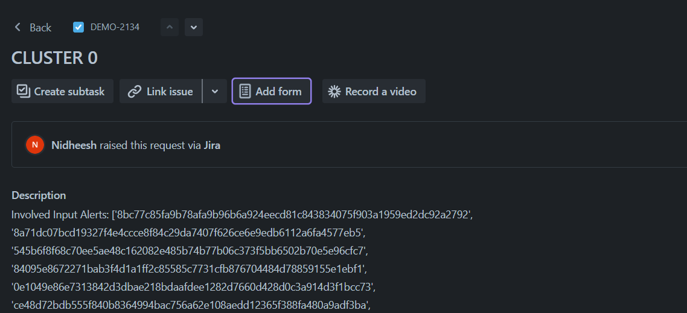
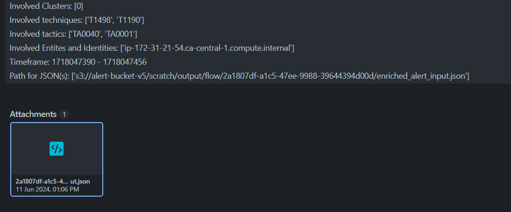
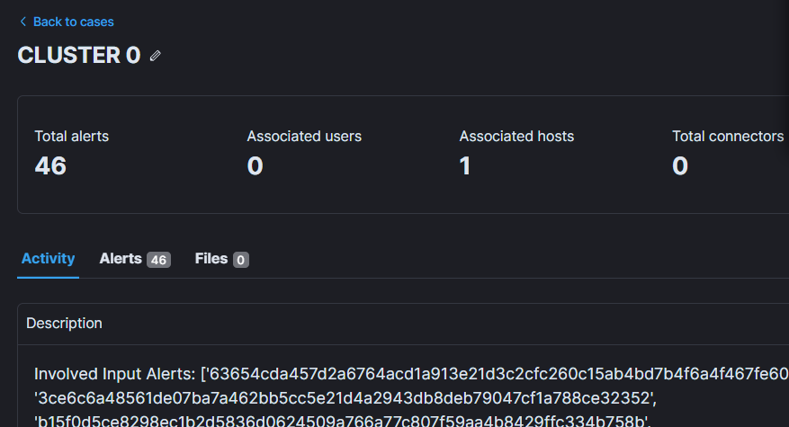

Cypienta input processing
-------------------------

Uploading the Input File
~~~~~~~~~~~~~~~~~~~~~~~~

Once the input is prepared by the transformation script, follow these
steps to upload the JSON file to the S3 bucket:

1. **Locate the Input Folder**: Ensure that the S3 bucket was created by
   the Cypienta CloudFormation stack.
2. **Upload the JSON File**: Upload the prepared JSON file to the
   ``input`` folder of the specified S3 bucket.

Monitoring Progress
~~~~~~~~~~~~~~~~~~~

To monitor the progress of the transformation and processing, use the
following resources:

-  **CloudWatch Logs**: Check the CloudWatch logs for each Lambda
   function and transform job created for the specific input. These logs
   provide detailed information on the processing status.
-  **S3 Bucket**: Wait for the complete output to appear in the S3
   bucket. The output file will be located at
   ``s3://alert-detector/output/cluster.json``.

Viewing Results
~~~~~~~~~~~~~~~

Once the ``cluster.json\ `` file is updated in the S3 bucket, you can
verify the results through the following:

-  **JIRA Tickets**: A JIRA ticket will be created for each cluster
   identified in the ``cluster.json\ `` file where number of events greater than the set threshold for a cluster.
-  **Elastic Security Cases**: An Elastic Security case will also be
   created for each cluster where number of events greater than the set threshold for a cluster.

JIRA ticket:

Attached invovled alerts:

When a JIRA ticket is created, the title will correspond to the cluster
ID found in the ``cluster.json`` file on the S3 bucket. The description of
the JIRA ticket will include the following details:

-  **Involved Input Alerts**: A list of alert IDs that were present in
   the ``input.json``
-  **Involved Clusters**: A list of clusters associated with the
   involved alerts.
-  **Involved Techniques**: A list of MITRE ATTACK Techniques present in
   the cluster.
-  **Involved Tactics**: A list of MITRE ATTACK Tactics present in the
   cluster.
-  **Involved Entities and Identifiers**: A list of source and
   destination entities in the cluster.
-  **Timeframe**: The timeframe of the input alerts within the cluster.

Additionally, an attachment of the input alerts will be added to the
JIRA ticket, detailing the alerts present in the cluster.

By providing these details, the JIRA ticket will offer a comprehensive
overview of the identified clusters, aiding in efficient incident
management and response.

Elastic case:

The Elastic Security case will contain the same title and description as
the JIRA ticket. This ensures consistency and ease of reference across
both platforms. The Elastic Security case will include alerts,
which connects the Elastic case directly to the corresponding involved alerts.
