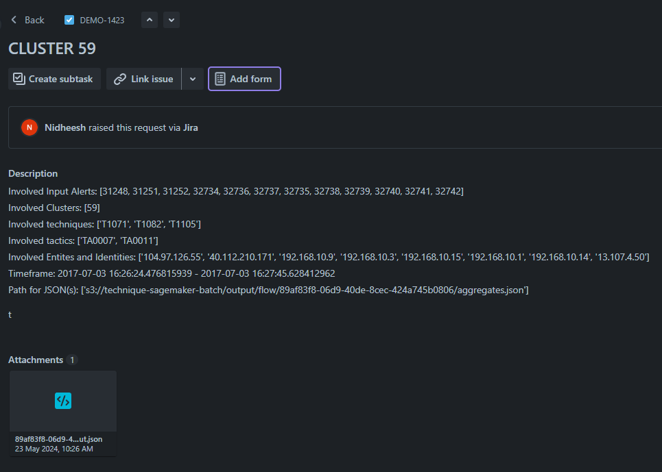
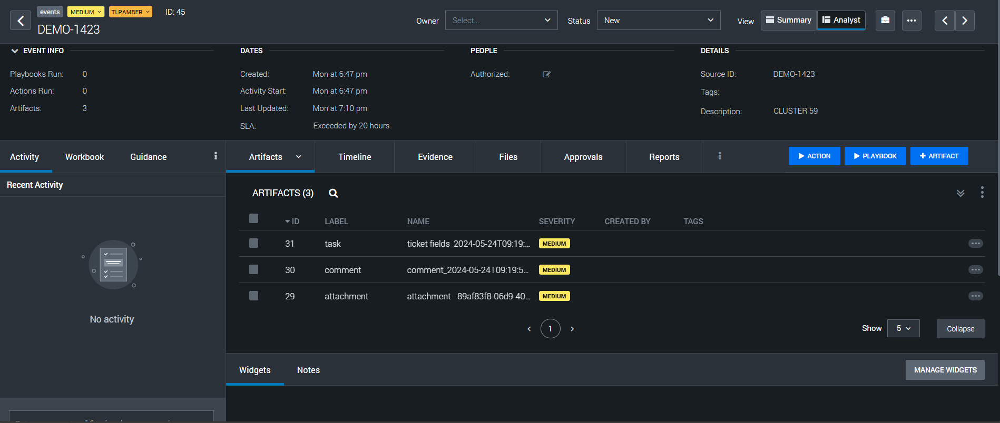

Configure Splunk
================

.. Getting data from Splunk to S3
.. ------------------------------

.. To get search results of Splunk to AWS S3. Follow the steps below:

.. 1. Login to the splunk instance. Click on the ``Apps`` drop down from the top panel. Select ``Find More Apps``

..     .. image:: splunk_resources/find_apps.png
..         :alt: Find more apps
..         :align: center

.. 2. Search for ``Amazon S3 Uploader``, and find the ``Amazon S3 Uploader for Splunk`` app from the list. Click on ``Install``, and enter your credentials to install the app.

.. 3. After installing the app, move to the home page, and click on ``Apps`` again. You should now see ``Amazon S3 Uploader for Splunk`` in the list. Click on the app and a configuration page will appear.

..     .. image:: splunk_resources/s3_app.png
..         :alt: Select S3 app
..         :align: center

.. 4. On the configuration page. Click on the ``Account`` tab, and click on ``Add`` to add an AWS account.

..     Then click on the ``IAM Role`` tab, and add an IAM role that has ``write`` permissions to S3.

..     In the ``Logging`` tab, the ``Log level`` is set to ``INFO`` by default, modify it as required.

..     .. image:: splunk_resources/app_config.png
..         :alt: Configure app
..         :align: center

.. 5. Now move to the search tab, and write a query

..     .. image:: splunk_resources/search_tab.png
..         :alt: Search for events
..         :align: center

.. 6. Verify that you have received the desired events. And then click on the ``Save As`` button on top of the search bar, and select ``Alert``.

..     .. image:: splunk_resources/save_alert.png
..         :alt: Save query as alert
..         :align: center

.. 7. Next, add the ``Title`` and ``Description`` for the alert, setup alert schedule and trigger conditions as required. And under the Trigger Actions section, click on ``Add Actions`` button. Select ``Upload to Amazon S3`` option.

..     .. image:: splunk_resources/select_action.png
..         :alt: Configure action for alert
..         :align: center

.. 8. Add the ``Bucket name`` where you want splunk to save the results. Use ``Object key`` as ``.json``. Select ``Account``, ``Role`` that you created on the configuration page from the dropdown. FInally click ``Save``. 

Configure integration with JIRA
-------------------------------

Integrate the JIRA management to Splunk SOAR to create event for each JIRA issue created.

1. Install JIRA add-on app for Splunk SOAR. Go to the ``Apps`` page on splunk SOAR.

    .. image:: splunk_resources/select_add_on.png
        :alt: Configure action for alert
        :align: center

2. Click on the ``New Apps`` button and then search for ``jira``. There will be a result for ``JIRA``, appearing for the add-on app. Click on ``Install`` button to install the add-on app.

3. To configure the app, click on ``Configure New Asset``
    
    .. image:: splunk_resources/get_add_on.png
        :alt: Configure action for alert
        :align: center

    Initially the app will be listed under ``Unconfigured apps``.

4. In ``Asset name`` field, add a name of your choice.

    .. image:: splunk_resources/configure_asset.png
        :alt: Configure action for alert
        :align: center

5. Move to ``Asset Settings`` tab. Give a JIRA URL, username, API token and project key from which you want to poll and sync Splunk SOAR events from. 
    Select the ``Maximum tickets (issue) to poll first time`` as a number greater than the total number of JIRA issues present in the JIRA management at the time of configuring the add-on.
    Select the ``Maximum ticket (issues) for scheduling polling`` as a number of latest issues that you want to poll each time.

    .. image:: splunk_resources/asset_setting.png
        :alt: Configure action for alert
        :align: center

6. Move to ``Ingest Settings`` tab. For the ``Label to apply to objects from this source`` field, select ``events`` and set the ``Select a polling interval or schedule to configure polling on this asset`` to ``Interval``. Select polling interval ``Polling interval (minutes)`` of your choice.

    .. image:: splunk_resources/ingest_setting.png
        :alt: Configure action for alert
        :align: center

7. Click on ``Save`` button to save the config for the add-on. Wait for the interval minutes set to allow Splunk SOAR to start polling JIRA issues to Splunk SOAR events.

8. Use the ``poll now`` button to poll the JIRA issues right now. Set the ``Maximum containers`` as the same value as set for ``Maximum tickets (issue) to poll first time``. Set ``maximum artifacts`` to a desired value, and click on ``Poll Now`` button.

    .. image:: splunk_resources/poll_now.png
        :alt: Configure action for alert
        :align: center

Cypienta Input Processing
-------------------------

Uploading the Input File
~~~~~~~~~~~~~~~~~~~~~~~~

Once the input is prepared by the transformation script, follow these steps to upload the JSON file to the S3 bucket:

1. **Locate the Input Folder**: Ensure that the S3 bucket was created by the Cypienta CloudFormation stack.
2. **Upload the JSON File**: Upload the prepared JSON file to the ``input`` folder of the specified S3 bucket.

Monitoring Progress
~~~~~~~~~~~~~~~~~~~

To monitor the progress of the transformation and processing, use the following resources:

-  **CloudWatch Logs**: Check the CloudWatch logs for each Lambda function and transform job created for the specific input. These logs provide detailed information on the processing status.
-  **S3 Bucket**: Wait for the complete output to appear in the S3 bucket. The output file will be located at ``s3://alert-detector/output/cluster.json\ ``.

Viewing Results
~~~~~~~~~~~~~~~

Once the ``cluster.json\ `` file is updated in the S3 bucket, you can verify the results through the following:

-  **JIRA Tickets**: A JIRA ticket will be created for each cluster identified in the ``cluster.json\ `` file.
-  **Splunk SOAR Event**: A Splunk SOAR Event will also be created for each cluster.

JIRA ticket:

When a JIRA ticket is created, the title will correspond to the cluster ID found in the ``cluster.json`` file on the S3 bucket.  Description of the JIRA ticket will include the following details:

-  **Involved Input Alerts**: A list of alert IDs that were present in the ``input.json``
-  **Involved Clusters**: A list of clusters associated with the involved alerts.
-  **Involved Techniques**: A list of MITRE ATTACK Techniques present in the cluster.
-  **Involved Tactics**: A list of MITRE ATTACK Tactics present in the cluster.
-  **Involved Entities and Identifiers**: A list of source and destination entities in the cluster.
-  **Timeframe**: The timeframe of the input alerts within the cluster.

Additionally, an attachment of the input alerts will be added to the JIRA ticket, detailing the alerts present in the cluster.

By providing these details, the JIRA ticket will offer a comprehensive overview of the identified clusters, aiding in efficient management and response.

Splunk event:

The Splunk SOAR event will contain the same title and description as the JIRA ticket under the ``Artifacts`` tab. This ensures consistency and ease of across both platforms. 

By integrating these features, users can seamlessly navigate between the Splunk SOAR event and the JIRA ticket, facilitating efficient incident tracking and resolution.
